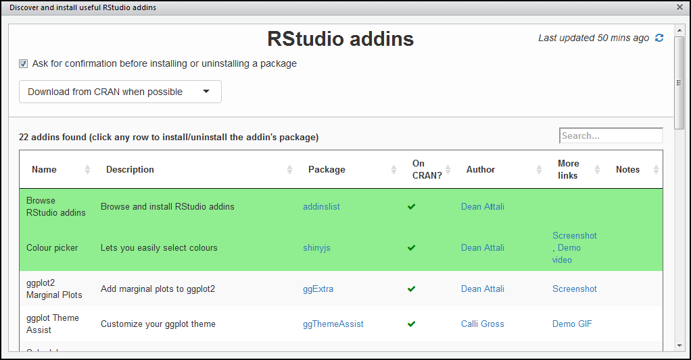
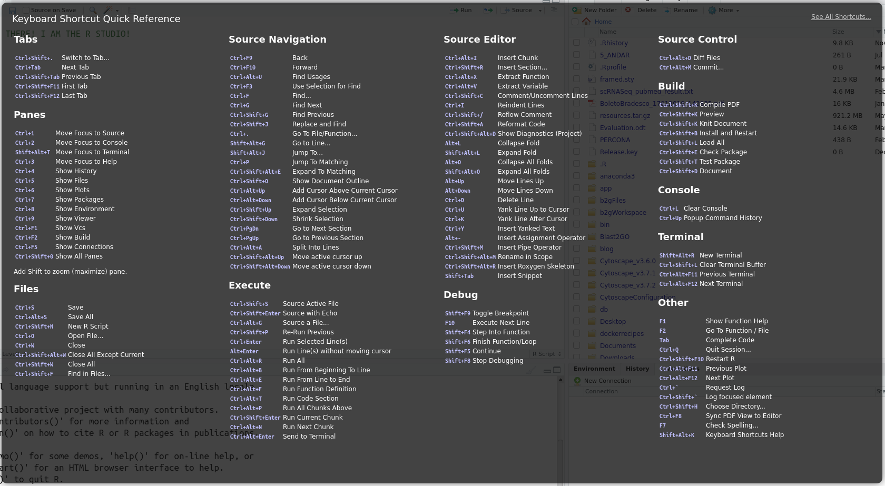
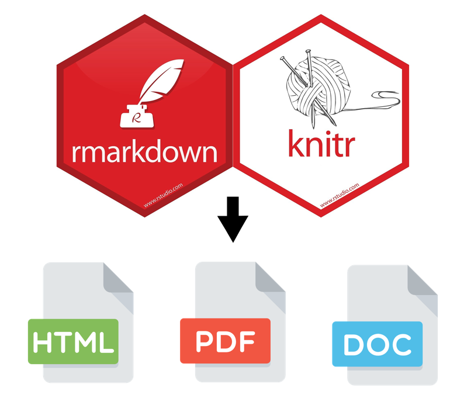
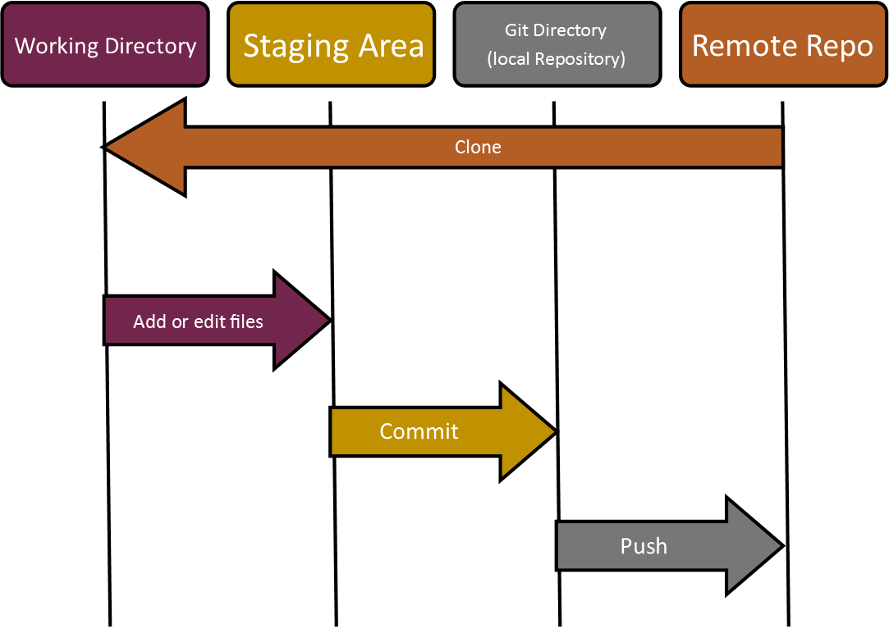

```{r setup, include = FALSE}

knitr::opts_chunk$set(echo = FALSE, fig.path = "figures/")
options(htmltools.dir.version = FALSE)

library(knitr)

```

# Presentation outline

- Can we talk about reproducibility?
- A gentle introduction to Rstudio
  + Panes, Shortcuts and Addins
- Organizing myself with Rprojects!
  + What you shouldn't do...

--
- Day-to-day workflow
- Communicate your results like a boss!
- Welcome to RMarkdown
- Hands-on moment...
- Coding version: last but not less important
- Finally! To sum up!

---

# Can we talk about reproducibility?


"The reproducibility of data is a measure of whether results in a paper can be attained by a different research team, using the same methods. This shows that the results obtained are not artifacts of the unique setup in one research lab. [1]"

---

<iframe width="1300" height="600" src="https://www.youtube.com/embed/s3JldKoA0zw" frameborder="0" allow="accelerometer; autoplay; encrypted-media; gyroscope; picture-in-picture" allowfullscreen>
</iframe>

---

# A gentle introduction to Rstudio

RStudio is an integrated development environment for R, a programming language for statistical computing and graphics. The RStudio IDE is developed by RStudio, Inc., a commercial enterprise founded by JJ Allaire, creator of the programming language ColdFusion.

How to install? Check it [out](www.google.com.br)!

---
class: center
# Panes, Addins and Shortcuts


**Figure 1. Rstudio panels.** *Source*, coding area similar text editor. *Console*, all code typed into "Source" area will be evaluated into R Console. *Environment/History*, in this panel we can inspect what objects were loaded into your workspace. *Files/Plots/Packages/Help*, another useful panel, allowing directory browsing, plot visualization, package installation or selection. 

---
class: center



## 
---
class: center

## For now keep in my **Ctrl+Alt+I** to insert a new code chunk

---
# Organizing myself with Rprojects!

**RStudio** projects make it straightforward to divide your work into multiple contexts, each with their own working directory, workspace, history, and source documents.

But what it means? In short, productivity and **less headache**

---
The .RProj in a nutshell!

1. Creates a project file (with an .Rproj extension) within the project directory. This file contains various project options (discussed below) and can also be used as a shortcut for opening the project directly from the filesystem.

2. Creates a hidden directory (named .Rproj.user) where project-specific temporary files (e.g. auto-saved source documents, window-state, etc.) are stored. This directory is also automatically added to .Rbuildignore, .gitignore, etc. if required.

3. Loads the project into RStudio and display its name in the Projects toolbar (which is located on the far right side of the main toolbar)

[Oficial Documentation](https://support.rstudio.com/hc/en-us/articles/200526207-Using-Projects) 

---

## For your convenience

1. Click the **File** menu button, then **New Project**.
2. Click **New Directory**.
3. Click **New Project**.
4. Type in the name of the directory to store your project, e.g. **my_project**.
5. If available, select the checkbox for **Create a git repository.**
6. Click the **Create Project** button.

(WAIT! We gonna have a hands-on moment)

---

### What you shouldn't do...

https://www.tidyverse.org/blog/2017/12/workflow-vs-script/

[Please, bitch...]

---
# Presentation outline

- Can we talk about reproducibility?
- A gentle introduction to Rstudio
- Organizing myself with Rprojects!
- **Day-to-day workflow**
- Communicate your results like a boss!
- Welcome to RMarkdown

--
  + Markdown syntax to document style
  
--
  + Saving as HTML, pdf or doc

--
- Hands-on moment o/
- Coding version: last but not less important
- Finally! To sum up!

---


# Day-to-day workflow

---
# Communicate your results like a boss!

[Traditional way and Boss way scheme]

---
# Welcome to RMarkdown 

Basically, it is an authoring framework for data science developed by RStudio Team. RMarkdown is an R package build upon **Markdown** is a text-to-HTML conversion tool for web writers. Originally Markdown was written in **Perl**,  allowing you to write using an easy-to-read, easy-to-write plain text format, then convert it to structurally valid XHTML (or HTML).

---
### Markdown syntax to document style

<iframe src="documents/rmarkdown-2.0.pdf" width="95%" height="80%">
This browser does not support PDFs. Please download the PDF to view it: Download PDF
</iframe>

---
class: center
# Saving as HTML, pdf or doc


---

### Almost in the hands-on moment! But first, a few concepts in RMarkdown!

[RMarkdown concepts]

---
# Hands-on moment...

1. Click the *File* menu button, then *New File*.
2. Click *R Markdown*.
3. Type the title *My R Mardown*.
4. Type the author name *It is me, Mario*.
5. Click *HTML* as default output format.
6. Finally, click the *OK* button.

---
# Presentation outline

- Can we talk about reproducibility?
- A gentle introduction to Rstudio
- Organizing myself with Rprojects!
- Day-to-day workflow
- Communicate your results like a boss!
- Welcome to RMarkdown
- Hands-on moment o/
- **Coding version: last but not less important**

--
  + Git and Git hosting services

--
  + Using Git through RStudio

--
- Finally! To sum up!

---
# Coding version: last but not less important

[Version coding and Git concept]

---
class: center

---

## A few basic command in Git that you should know...

- init
- clone
- remote
--

- status
- add
- commit
- push

--
- pull
- merge

#### We are not covering git commands in this class, but I strongly suggest you guys understand more about the program. Please check out this outstanding [tutorial](https://rogerdudler.github.io/git-guide/)

---
background-image: url(figures/git_flavors.jpg)
background-size: cover
class: center, bottom, inverse

# Git and Git hosting services

### Wait! Let's create a GitHub [account](https://http://github.com) !
---

<iframe width="1300" height="600" src="https://www.youtube.com/watch?v=ezxRcdJ8glM" frameborder="0" allow="accelerometer; autoplay; encrypted-media; gyroscope; picture-in-picture" allowfullscreen>
</iframe>

---
# Using Git through RStudio
 
1. Create a **New Project**
4. Type in the name of the directory to store your project, e.g. **my_project**.
5. If available, select the checkbox for **Create a git repository.**
6. Click the **Create Project** button.


---
# Finally! To sum up!

[Project creation and workflow]

---
# Is this all? Of course...

#### *But no*

### More about good pratices

- You may should take a look in *Lintr*
- Or Tidyverse coding style
- Project organization

---
# A few extras :)

### To study

- Bookdown and Blogdown
- Shiny Apps
- Rticles package
- **R presentations**

---
class: center, inverse
  
# Thanks you!
### oandrefonseca@gmail.com

---
# References

1. Repeatability vs. Reproducibility [1]
2. Is there a reproducibility crisis in science? [2]
3. RMarkdown CheatSheet by RStudio [3]
4. Rstudio CheatSheet [4]

[1]: https://www.technologynetworks.com/informatics/articles/repeatability-vs-reproducibility-317157 "Repeatability vs. Reproducibility"
[2]: https://www.youtube.com/watch?v=FpCrY7x5nEE "Is there a reproducibility crisis in science?"
[3]: https://rstudio.com/wp-content/uploads/2015/02/rmarkdown-cheatsheet.pdf "RMarkdown CheatSheet by RStudio"
[4]: https://rstudio.com/wp-content/uploads/2016/01/rstudio-IDE-cheatsheet.pdf "Rstudio CheatSheet"
